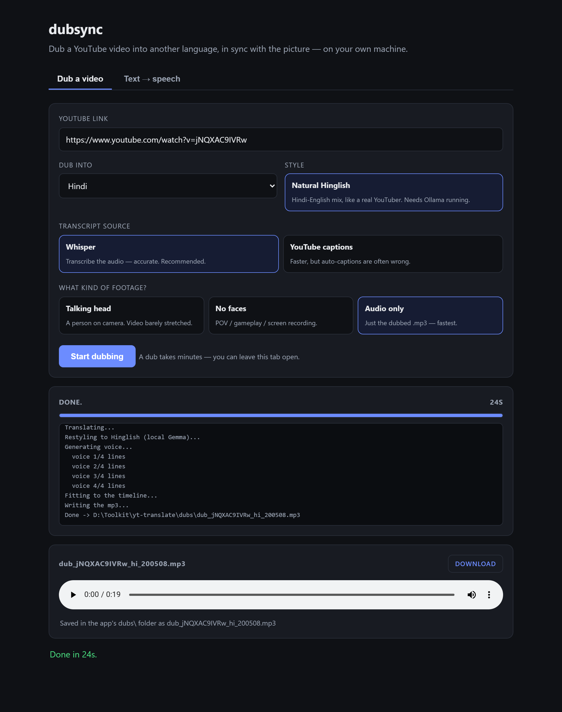

# dubsync — dub a YouTube video into another language, in sync

Paste a YouTube link, pick a language, get back a dub whose voice stays **in time with the
picture**. Everything runs on your own machine: no account, no API keys, nothing uploaded
but the video request itself.



## Get it (Windows)

**→ [Download the latest release](https://github.com/Sagelakshya/dubsync/releases/latest)** and grab
**`dubsync-portable-win64.zip`** (about 260 MB).

1. Extract the zip anywhere (Downloads is fine).
2. Double-click **`Start dubsync.cmd`**. Your browser opens the app.
3. Paste a link, pick a language, press **Start dubbing**.

There is nothing to install: the folder carries its own Python, ffmpeg, and the speech-recognition
runtime. The first dub also downloads the Whisper model (about 0.5 GB, once). Windows 64-bit only.

> **Not the green "Code → Download ZIP" button.** That gives you the source without Python, ffmpeg or
> the model runtime, and it will not run by double-clicking. Use the release zip above, or follow the
> from-source setup below if you actually want to work on the code.

If Windows SmartScreen warns about the `.cmd` file, click *More info* then *Run anyway*. A `.cmd` is a
plain text file — open it in Notepad and read it first if you like.

---

Running from source instead? Two ways in, once you've done the [setup](#setup-one-time):

- **The app:** double-click **`run.cmd`** (the release's `Start dubsync.cmd` does the same thing
  without needing Python installed).
- **The command line:** double-click **`dub.cmd`** for the same questions in a console, or drive
  `dub.py` with flags for the finer knobs — every option is documented below.

## The app
`run.cmd` starts a small local web server and opens `http://127.0.0.1:5000`.
Two tabs:

1. **Dub a video** — link + language + options → live progress → download.
   Options are the ones that matter: natural **Hinglish** (Hindi only),
   transcript source (Whisper or captions), and footage type (talking head /
   no faces / audio only). A dub takes minutes, so it runs in the background and
   the page shows the stage it's on, the log, and elapsed time. Finished files
   also land in the app's `dubs\` folder.
   A **transcript panel** appears as soon as the script is final, which is before
   the audio finishes rendering: every sentence with its timestamp, the original
   English, and what actually gets spoken. Any line where an idiom was swapped is
   marked with the substitution, since that is the one part of the output which is
   deliberately not a translation of the words above it. English can be hidden to
   read the target language alone, and the whole thing copies to the clipboard.
2. **Text → speech** — paste any script, optionally translate it first, pick a
   voice (male/female per language) and a speed, get an `.mp3`. No video needed.

Nothing leaves your machine except the translation/voice calls the tool has always
made (Google Translate, Microsoft Edge voices) and the video download itself.

## Setup (one time)

You need **Python 3.10+** installed ([python.org](https://www.python.org/downloads/),
tick "Add Python to PATH" during install).

**Windows — easiest:** double-click **`run.cmd`**. The first run installs
everything automatically, then starts the app.

**Any OS — manual:**
```bash
python -m venv .venv
# Windows:  .venv\Scripts\activate
# Mac/Linux: source .venv/bin/activate
pip install -r requirements.txt
python app.py
```

**Dubbing needs ffmpeg.** (Text → speech and caption translation don't.) Get it
working one of three ways: install ffmpeg and add it to your PATH; drop
`ffmpeg.exe` + `ffprobe.exe` into an `ffmpeg\bin` folder next to `dub.py`; or set
an `FFMPEG_DIR` environment variable to the folder that holds them.

Stop the app with **Ctrl+C** in the terminal window.

## Notes
- Long videos are translated in chunks automatically.
- Free Google Translate quality is good, not perfect.
- Everything runs locally; nothing is stored.

## Synced dub (`dub.py`) — the engine, on the command line

The app drives `dub.py`; these are the same runs with the finer knobs exposed.
It keeps every sentence's timestamp and produces a translated voiceover **synced
to the video timeline**. Run it from the same venv:
`.venv\Scripts\python.exe dub.py ...`

```bash
# audio only — a dubbed.mp3 that lines up when played alongside the video
.venv\Scripts\python.exe dub.py "https://youtu.be/VIDEO_ID" --lang hi

# download the video and mux the dub straight onto it
.venv\Scripts\python.exe dub.py VIDEO_ID --lang es --download --out dubbed.mp4

# use a video you already have (skips the download)
.venv\Scripts\python.exe dub.py VIDEO_ID --lang es --video clip.mp4 --out dubbed.mp4

# keep the original audio faintly under the dub (music/ambience)
.venv\Scripts\python.exe dub.py VIDEO_ID --lang hi --download --keep-original 0.15
```

**The core guarantee — every line fits its time slot.** Translated speech is
usually a different length than the original (English→Hindi expands, Hindi→English
shrinks). Each sentence is sped up by exactly the factor needed to fit its caption
window — `atempo`, which preserves pitch, so it's *faster speech*, not chipmunk —
so the dub stays locked to the video with essentially zero drift. Shorter lines
aren't slowed; the natural pause after them absorbs the slack.

How it works: transcript → regrouped into sentences (each with a time window) →
translated per sentence → spoken with edge-tts → **fit** into its window → laid
onto a silent timeline at its real offset.

### Transcript source: Whisper (default) or captions

The dub's accuracy ceiling is its transcript, so by default `dub.py` **transcribes
the audio itself** with Whisper (`faster-whisper`) — accurate, punctuated, whole
sentences. That matters: YouTube auto-captions often chop a sentence mid-thought,
which strips the context the translator needs ("long trunks" with no "elephant"
nearby gets mistranslated). Whole sentences fix that at the source. Whisper also
works on videos that have **no captions at all**.

```bash
# default — transcribe the audio (accurate); first run downloads the model (~0.5 GB)
.venv\Scripts\python.exe dub.py VIDEO_ID --lang hi

# faster: use YouTube captions instead (warns if they're the auto-generated kind)
.venv\Scripts\python.exe dub.py VIDEO_ID --lang hi --source captions

# bigger Whisper model = more accurate, slower (tiny/base/small/medium/large-v3)
.venv\Scripts\python.exe dub.py VIDEO_ID --lang hi --whisper-model medium
```

Whisper uses the GPU when CUDA/cuDNN is available and **falls back to CPU**
otherwise (slower on long videos, but it always works).

### Hinglish — natural Hindi-English (Hindi only)

`--hinglish` makes the Hindi dub sound like a real Indian YouTuber (Hindi grammar
with the English words people actually say — बिज़नेस, ऑनलाइन, प्रॉब्लम) instead of
stiff *shuddh* Hindi. It runs **locally and free** — no API key, no usage limit.

```bash
.venv\Scripts\python.exe dub.py VIDEO_ID --lang hi --hinglish
#   setup: install Ollama (ollama.com), then:  ollama pull gemma3:4b
```

How it works: a deterministic dictionary swaps the words that always swap
(व्यवसाय→बिज़नेस), then a local Gemma-3-4B pass fixes the rest in one batched call.
The model only *restyles* Hindi that Google already translated — it never
translates from scratch, which is where small models invent words. Uses the GPU if
you have one, CPU otherwise. If Ollama isn't running the dub **stops with an error**
rather than quietly handing back formal Hindi: you asked for Hinglish, so silently
serving something else would be a downgrade with nothing on screen to say so. The
model is checked before transcription starts, so you find out in seconds.

### Idioms — English idiom → Hindi idiom (English → Hindi)

Translators are confidently literal about figurative language. "You can see the
blood run from their face" comes back as people visibly **bleeding**; "brownie
points" as ब्राउनी पॉइंट; "that old chestnut" as पुराना चेस्टनट. The listener
doesn't hear a translation artifact, they hear a sentence that makes no sense.

Every English→Hindi dub now runs a deterministic idiom pass first. The idiom is
replaced by **the Hindi idiom used in the same situation**, never by its literal
words and never by a flattened paraphrase (a paraphrase is accurate but reads like
a textbook — चेहरे का रंग उड़ जाना is what a Hindi speaker actually says).

| English | plain translation | with the dictionary |
|---|---|---|
| see the blood run from their face | उनके चेहरे से **खून बहता** देख सकते हैं | उनके **चेहरे का रंग उड़** जाता है |
| who gets all the brownie points | सभी **ब्राउनी पॉइंट** किसे मिलते हैं | **शाबाशी** किसे मिलती है |
| remember that old chestnut? | वह **पुराना चेस्टनट** याद है? | वो **घिसी-पिटी बात** याद है? |
| give me a break | मुझे एक **विराम** दें | थोड़ा **चैन से रहने दो** |
| she was really hopeless | वह वास्तव में **निराश** थी | वो पढ़ाई में बिल्कुल **फिसड्डी** थी |

It runs for any English→Hindi translation, with or without `--hinglish`, because
it fixes meaning rather than register. No model and no network: the same input
always maps the same way.

**The dictionary is data, not code** — [`data/idioms_en_hi.json`](data/idioms_en_hi.json).
Add entries without touching Python or rebuilding anything, then check them:

```bash
python verify.py                 # run every entry through the real translator
python idioms.py --list          # show the dictionary
python idioms.py "some english"  # see plain vs idiom-corrected side by side
```

`verify.py` is the growth gate. A bad entry doesn't crash, it just ships a wrong
sentence quietly, so mechanical faults (an entry that doesn't match its own
example, a placeholder lost in translation) **fail**, and slots where Hindi
agreement could break are flagged for a human to read. `idioms.py` imports nothing
from dubsync, so it is reusable for subtitles, copy, or any other English→Hindi work.

- **Dense speech:** effectively perfect — a 14-min talk to Spanish held under ~1s
  drift with the final line dead on time; every line lands on its caption time.
- **The trade you control:** to *guarantee* fit, expansion-heavy lines get sped
  up. A very slow, pause-heavy speaker can need 2–3× on a stretch (the run prints
  which lines and how fast). Dials:
  - `--voice NAME` — which voice speaks the dub, e.g. `--voice hi-IN-MadhurNeural`
    for a male Hindi voice. Defaults to the language's standard voice. Run
    `dub.py --list-voices` for the full list, or use the **Voice** picker in the
    web app. An unknown name is rejected before any work starts.
  - `--max-speed 1.5` — the "natural" threshold; lines faster than this are flagged.
  - `--hard-max 3.0` — absolute ceiling used to force the fit.
  - `--tts-rate-max 40` — how much of an overrun the **voice** absorbs by speaking
    faster, before ffmpeg squeezes the rest. Overrunning lines are re-spoken by the
    voice engine at up to +40%, which sounds like brisk speech rather than a
    recording played fast. `0` restores the old ffmpeg-only behaviour. On a
    19-minute talk this took the lines forced past the `--hard-max` ceiling (i.e.
    clipped) from 26 down to 3.
  - `--allow-drift` — the opposite choice: cap at `--max-speed` for a calmer voice
    and let long lines overrun instead (re-anchored at the next pause).
    **Suits short clips.** On dense speech there are too few pauses to re-anchor
    against and the lag compounds — simulated on that same 19-minute talk it ends
    up over a minute behind the picture. Prefer `--retime` below for long video.
- `--download` needs internet; muxing/fitting needs the bundled `D:\Toolkit\ffmpeg`
  (or ffmpeg on PATH). Deps: adds `yt-dlp` (for `--download`) to what the web app
  already uses.

### `--retime`: keep the voice natural, stretch the video instead

The default fits by speeding the *audio* up. `--retime` does the opposite where it
helps: it keeps the voice near natural speed and gently **stretches the video** to
make room, splitting the mismatch across both so neither is pushed hard. A line
that would need 2.3× on audio alone becomes ~1.5× audio + ~1.5× video.

```bash
# hybrid retime, downloading the source
.venv\Scripts\python.exe dub.py VIDEO_ID --lang hi --retime --download

# presets (recommended) — pick by footage type instead of remembering numbers:
.venv\Scripts\python.exe dub.py VIDEO_ID --lang hi --faces --download   # talking heads: tight video bound (1.1x)
.venv\Scripts\python.exe dub.py VIDEO_ID --lang hi --broll --download   # POV/gameplay/screencast: 1.6x + --smooth

# or set the video bound by hand
.venv\Scripts\python.exe dub.py VIDEO_ID --lang hi --retime --video clip.mp4 --max-video 1.3
```

`--faces` = `--retime --max-video 1.1`. `--broll` = `--retime --max-video 1.6 --smooth`.
An explicit `--max-video` still overrides the preset.

- `--max-video 1.25` — cap on how far the video may be slowed. Lower it (~1.1) for
  faces; raise it for faceless footage. When both this and `--max-speed` are maxed
  and a line still doesn't fit, the audio takes the remainder (the fit always wins).
- `--smooth` — motion-interpolate the slowed video (smoother, but much slower to
  render). Leave off for a quick result with duplicated frames.
- **Needs the video** (`--download` or `--video`) and re-encodes it, so it's slower
  and heavier than the audio-only path. Alignment is exact: each line's audio is fit
  to the *measured* length of its rendered video segment, so nothing drifts.
- Retime **replaces** the original audio (it doesn't mix the original under, since
  that track would need retiming too). The net video length changes when there's
  net expansion — expected, since you're making room for the longer speech.
- **Best for faceless footage;** on talking heads the stretched motion is visible,
  so keep `--max-video` tight or use the default audio-fit mode there.

## Third-party components

Bundled runtime dependencies and their licences are listed in
[`THIRD-PARTY-LICENSES.md`](THIRD-PARTY-LICENSES.md), regenerated from the built
runtime's own package metadata. The Windows download also bundles a static
**ffmpeg** build; its licence and source notice ship inside the zip under
`licenses/ffmpeg/`.

## License

MIT — see [`LICENSE`](LICENSE).
